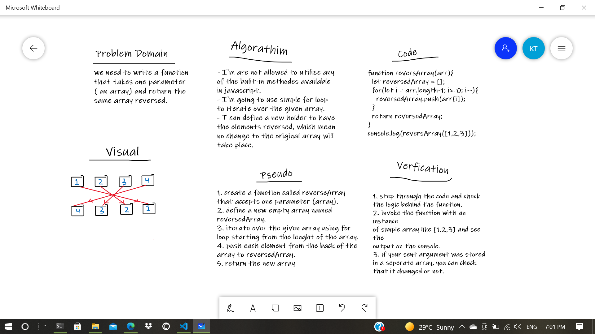

# Reverse an Array
<!-- Description of the challenge -->
Write a function called `reverseArray` which takes an array as an argument. Without utilizing any of the built-in methods available to your language, return an array with elements in reversed order.

## Whiteboard Process
<!-- Embedded whiteboard image -->

## Approach & Efficiency
<!-- What approach did you take? Discuss Why. What is the Big O space/time for this approach? -->
will I only used a simple for loop and .push() method for this problem, I don't really know how to calculate or figure out the time/space needed for this algorathim to be executed, but I don't think it will take that much 😁
